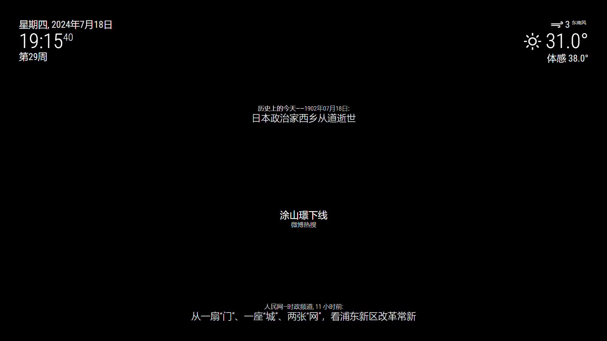

# MMM-weiboTopic

Magic Mirror模块，主要显示当前微博热搜。


## 预览


## 安装
运行以下命令：

```shell
cd modules
git clone https://github.com/slacker-HD/MMM-weboTopic.git
cd ..
npm install puppeteer
```
## 使用
在 `config/config.js` 文件中添加如下内容：
```js
var config = {
	modules: [
		{
			module: "MMM-weiboTopic",
			position: "lower_third",
			config: {
				updateInterval: 30, //second
				upgradeInetrval: 30 //minute
				animationSpeed: 1 //second
			}
		},
    ]
}
```